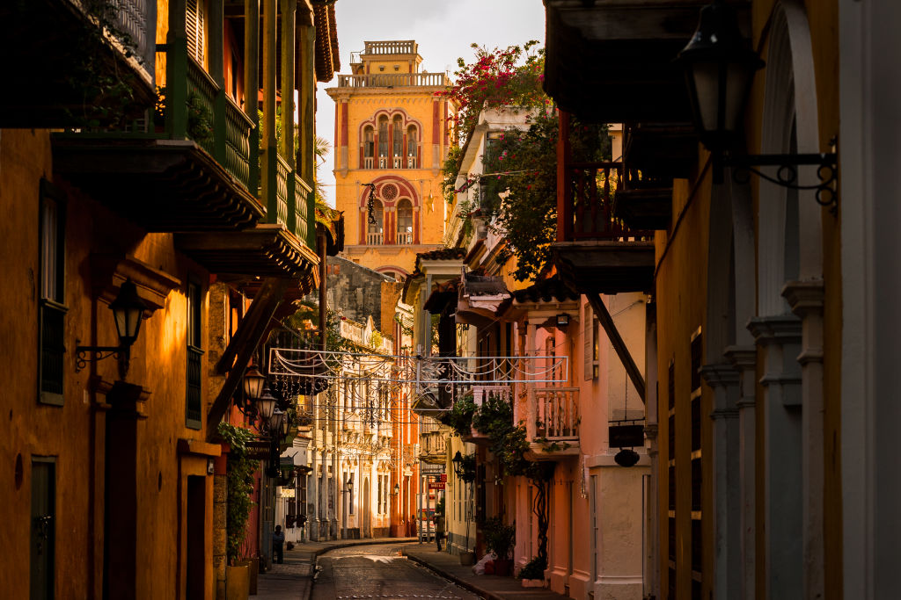
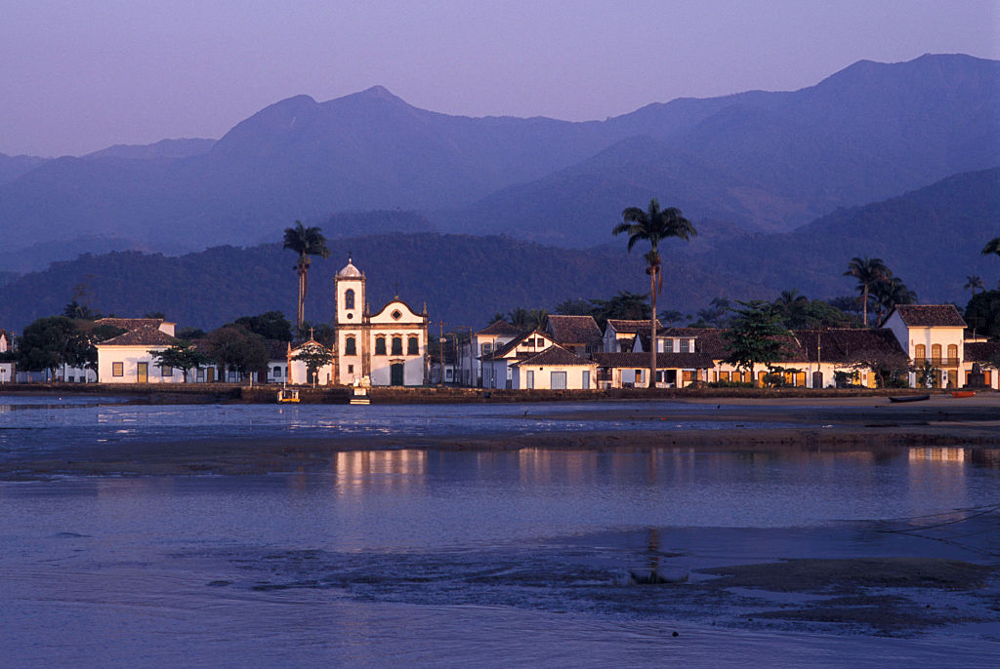

# COLONIAL PEARLS: CITIES FOR TRAVEL

Colonial cities as a magnet attract tourists from all over the world. They allow travelers as if to travel through time and present themselves as heroes of the Middle Ages. In addition, it is in colonial cities or their part always reigns some unusual atmosphere of relaxation, lightness and festivity. We have collected for you a selection of eight cities in the world, which every avid traveler should visit.

## Cartagena, Colombia

Cartagena is probably the most beautiful and attractive for tourists city in Colombia. And it is not surprising: bright architecture, many bars and restaurants and, of course, the Caribbean Sea. This pearl of Colombia was founded in 1533 and played a major role for the Spanish Empire, and its wealth was based on slavery, sugar and gold.

Today, Cartagena's Old Town is a maze of perfectly restored colonial houses, churches, squares, and monasteries. Characteristic of these buildings are overhanging wooden balconies covered with tiled roofs, and one or more shady patios inside. And if you come here in winter, you can see how balconies, windows and patios come to life with blossoming tropical flowers. In Cartagena, there is an atmosphere of festivity - the sounds of salsa, reggaeton, and Afro-Caribbean motifs are heard everywhere. There are many inexpensive restaurants with seafood, and in the bars the river Aguardiente (Spanish moonshine) flows. And if you want peace of mind, you can rent a cheap boat and go to the nearby uninhabited islands in the Caribbean Sea with crystal clear water.

## Paraty, Brazil

Paraty is not far from Rio de Janeiro, and it is a great option to travel from there for two days. This Portuguese colonial city had a high economic importance, as it was a port where slaves arrived and from where gold was sent to Europe, as well as a sugar cane production site.

Today, the city is a tourist destination. All streets are paved with cobblestones, and the houses are white with bright doors and windows. The whole center - a pedestrian zone, free of cars, which allows travelers to break away from reality. Mysterious symbols of the masonry decorate its walls, which gives free rein to the imagination. But Paraty and the nearby Ilya Grande (it is here that one of the best beaches in the world is located) have been awarded by UNESCO not only for their cultural value, but also for their natural one. There are four protected natural areas of the Brazilian Atlantic Forest, one of the five key biodiversity areas in the world. Paraty will also please beach lovers: staying here for a few days, you will get access to 60 islands and 300 beaches.
